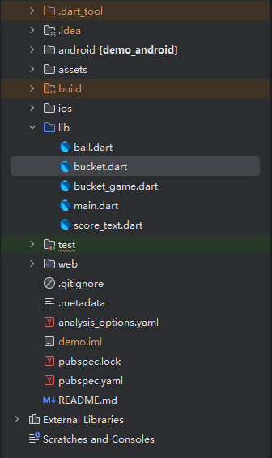
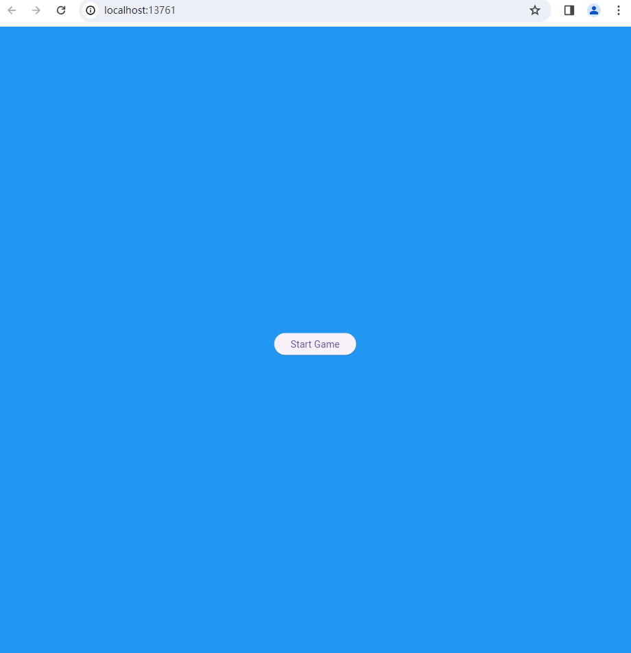
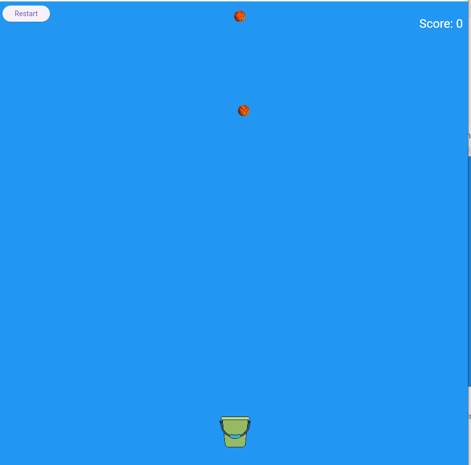
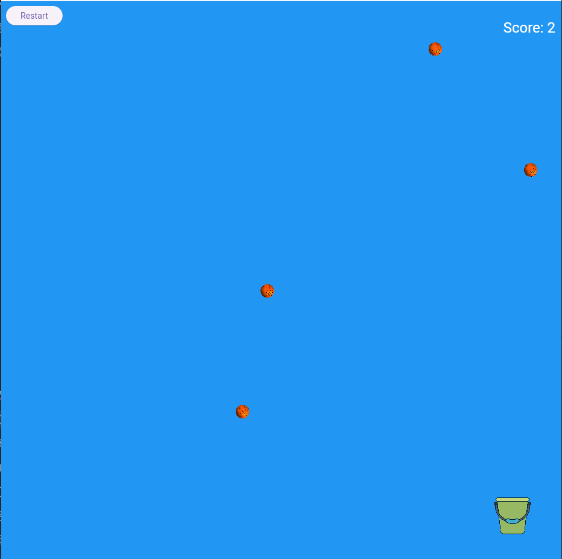
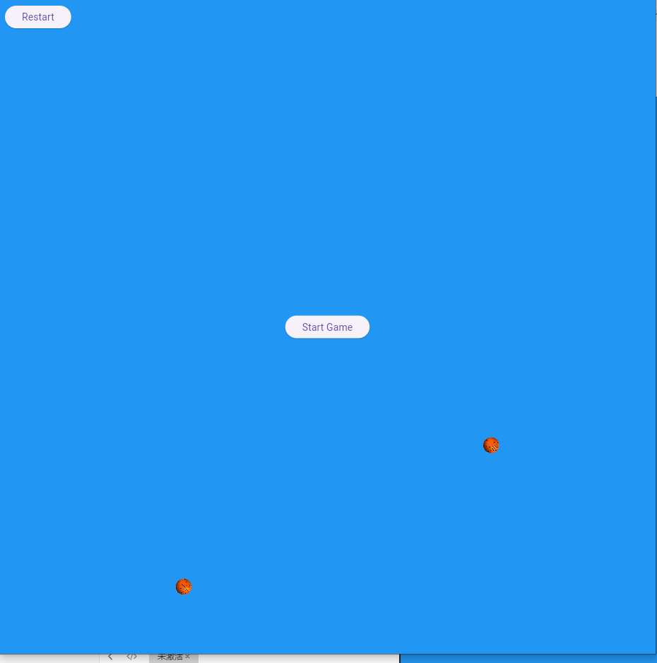
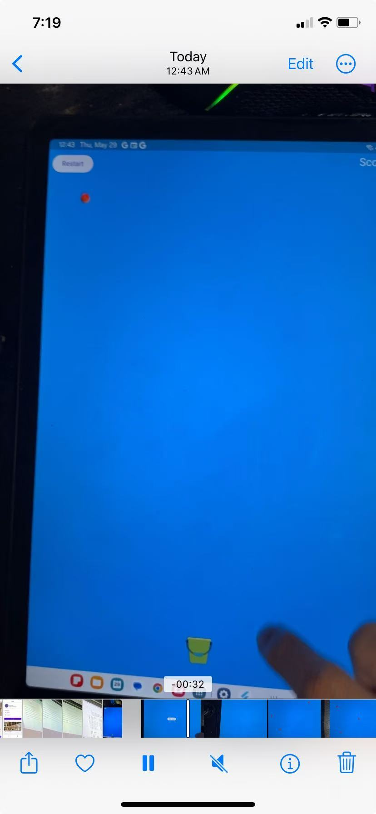
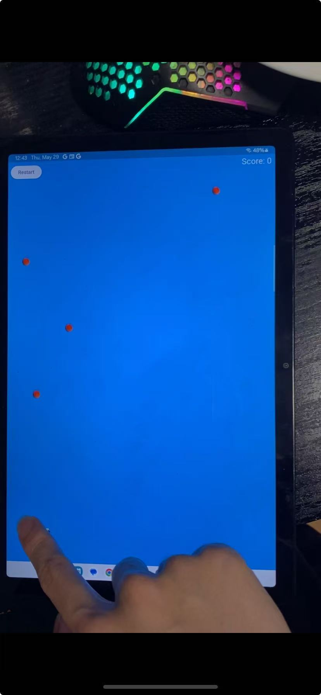
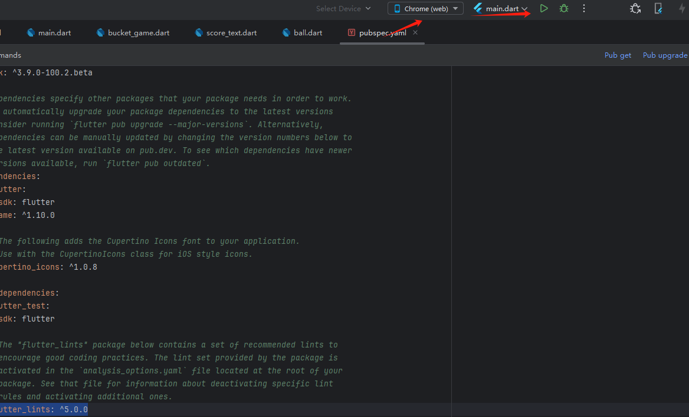
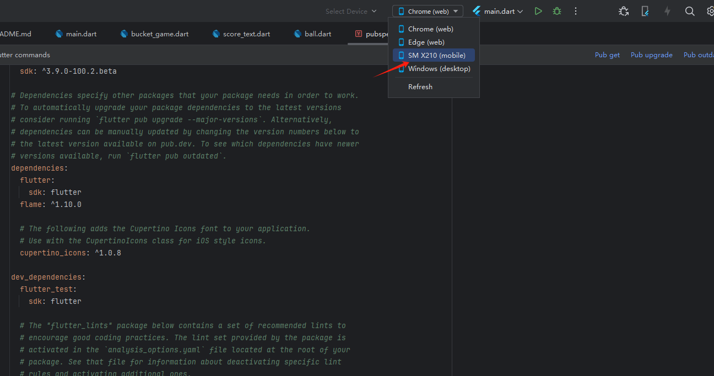

# Exercise 3

## 1. Environment

| tool    | version            |
| ------- | ------------------ |
| flutter | 3.33.0-1.0.pre.251 |
| dart    | 3.9.0              |

## 2.  Project structure

Project structure(source code: all *.dart under lib folder)



YAML Dependencies(pubspec.yaml):

```yaml
dependencies:
  flutter:
    sdk: flutter
  flame: ^1.10.0
  cupertino_icons: ^1.0.8

dev_dependencies:
  flutter_test:
    sdk: flutter
  flutter_lints: ^5.0.0
```


IDE: Android studio

platform: web,IOS, Android


## 3. How to play

1. After loading the game, there will be a "Start Game" button in the middle of the screen:

   

   

2. Press the "Start Game" button, there will be a bucket appearing on the screen and several balls falling

   

3. web: Control the bucket using the `arrowLeft` and `arrowRight` button to control the bucket movement,

   mobile: Drag the bucket to make it move horrizontally,

   after you catch a ball using the bucket, you will get one score and can be shown on top right. If you want to end the game, press Restart button on top left corner.

   

4. After pressing the restart button, you will see the Start Game button again to start again:

   


## 4.  Game on Physical device





## 5. How to run

1. After unzip the zip file, open the `Exercise3` as root folder in Android studio
2. run `flutter pub get` command to download all dependencies of the project at the root folder


**web:**

3. select `Chrome (web)` to run the project in browser adn press the run button. It will open up a new browser window for the app to run.

   

**Mobile(Android):**

3. Pre-requisite: Ensure you all follow all set-up steps in this link: https://docs.flutter.dev/get-started/install/windows/mobile

4. Plug your Android device into your computer  with USB Line

5.  Go to your setting > Developer Options > enable USB debugging  

6. Select your mobile device and click run. It should take some time to build for the first time . The following is my device:

   


## 6. Github link

https://github.com/junior-stack/COMP5450-E3
